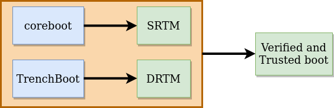
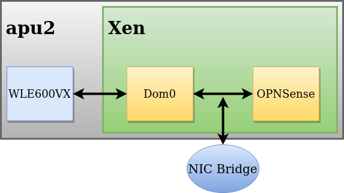

## Introduction

There are known issues related to WiFi cards not working with BSD-licensed
firewalls, especially newer ones. It is obvious that best solution for that kind
of problems is to implement an appropriate driver. However, is there a way to
avoid that path and still has reliable platform with WiFi and BSD software? Our
experience in virtualization technology and security fields led us on slightly
different approach. Eventually, it emerge in following form - **OPNSense under
Xen on top of coreboot + TrenchBoot, with secure updates support**. Sounds too
complex and overdone at first? Let me introduce assumptions we have formulated
and the benefits of that solution:

- *coreboot + TrenchBoot* ensure user that current firmware and further loaded
  components are not compromised
- *virtualization* solves WiFi card support problem in BSD firewalls and adds
  additional security
- *secure firmware and software updates* provide that everything comes from
  trusted source in case of upgrade
- every part of system is open source!

Of course, it is initial concept and many other features can be proposed and
added to final release. However, above requirements form a solid foundation,
which allows to build **High performance secure firewall with native WiFi
performance**.

Each section of this article describe each requirement, we set ourselves, in
details. Whereas last chapter introduce our recent results with demo and
performance analysis.

## coreboot + TrenchBoot = verified and trusted boot

Our first goal is to provide low-level security. One step to achieve that is to
use open source firmware. Second step is to enable all possible mechanisms which
allow to somehow measure and verify boot process. Third step is to join them
together and enjoy trusted platform. Seems easy, right? Actually, entire process
is more complicated and complex. For the purpose of this blog post I will
shortly introduce what tools and techniques we have used to meet first
requirement.

#### coreboot configuration

Our firmware is `coreboot` with enabled `vboot` feature. That configuration is a
way of implementation of **Static Root of Trust for Measurements** (SRTM). It is
a technology which measures and verifies device firmware components during boot
process. That components are in fact piece of codes of specific part of system.
Measurements of each are stored in Trusted Platform Module (TPM) special
registers. After coreboot ends its execution, firmware is being verified and if
it is not corrupted, next stage of booting starts.

>For details about SRTM I refer to articles and papers available in Internet
(e.g. [this
one](http://security.hsr.ch/mse/projects/2011_Root_of_Trust_for_Measurement.pdf))

#### TrenchBoot

TrenchBoot is the next stage running after coreboot execution ended. Security
concept is exactly the same as in previous case - measure and verify running
environment. TrenchBoot uses slightly different technology called **Dynamic Root
of Trust for Measurements** (DRTM). Pointing out differences is not a subject of
this article. To be honest, it is very complex topic and understanding it could
take too much time. What you need to know (or trust us about) is that other
TPM's registers store those measurements and running environment is verified and
can be described as trusted.

Below diagram presents described technologies and features. It is simplified,
but should give you main idea about their usage and role.

## Virtualization, isolation and WiFi performance

If virtualization, hypervisor, Xen, Dom0 and related terminology is foreign to
you, please get familiar with those blog posts first:

- [Xen Project](https://blog.3mdeb.com/2020/2020-02-05-meta-pcengines-xen/)
- [pfSense under Xen - part 1](https://blog.3mdeb.com/2019/2019-11-06-pfsense-under-xen-introduction/)
- [pfSense under Xen - part 2](https://blog.3mdeb.com/2019/2019-12-13-pfsense-boot-under-xen/)

When you already have basic knowledge, we can move on to the essential part of
this section.

There are issues with WiFi support on BSD-based firewalls. Many newer cards are
simply not usable due to lack of specific driver - Compex WLE600VX is a good
example. Our idea is to run `Xen` with `Dom0` and `OPNSense` in virtual machine. What
we gain with that approach? Dom0, as privileged domain, has direct access to
hardware. Also, our custom and adapted build of it, supports WLE600VX WiFi card.
OPNSense supports popular Ethernet Network Interfaces (e.g. Intel E1000). We
just fasten it together by passing WLE600VX WiFi from Dom0 to OPNSense as
emulated Intel E1000 NIC. It is so simple and so effective. For imagination of
that configuration, look at the diagram below.

As a result, we have reliable and working WiFi Card in router - although
OPNSense doesn't directly support it. There is also another benefit achieved
by virtualization. It introduces another level of security. Closing entities
(such as network interface, firewall software or operating system) in separate
environments minimizes the effects of a potential attack. User can be sure that
virus doesn't spread out to entire system, but stay only in infected part.

The idea of virtualization and separation is well implemented in **Qubes OS**.
If you have never heard about it, it is an operating system, which mainly focus
on security. To do that, it is using virtualization and isolation - with Xen and
Dom0. All running environments are user-depended and can be assigned to a
specific group. Each group has another level of trust and thus greater or
smaller exposure to attacks. Qubes OS proves that virtualization and isolation
technology can be successfully used in big projects. Solutions applied and
verified there can be surely implemented in smaller projects then - such as home
router.

## Secure updates

Last assumption we have made is to have possibility to update firmware and
software from trusted source. Many users are afraid of upgrading their firmware
in case of possible platform damage. Second factor is safety. Who can ensure
that newer version comes directly from BIOS vendor and is not already
'infected'? Luckily, there are platforms and tools which can provide it -
`fwupdmgr` with `Linux Vendor Firmware Service`. Shortly speaking, using them
gives user an assurance that an upgrade is safe and can be done almost without
effort. Of course, vendors can't sign up to trusted list just like that. Each
must complete verification process and only then can be marked as confirmed and
trusted vendor.

For our platform, secure update feature is a supplement of other ones. With it,
user get product which is not only reliable and secure, but also can be easily
managed and always kept up-to-date.

>If you are interested, what exactly is hidden behind fwupd concept, I refer to
our [LVFS and fwupd blog
post](https://blog.3mdeb.com/2019/2019-07-11-how-to-safely-and-easily-update-your-firmware/).

## Our implementation - final demo

## Summary

If you think we can help in improving the security of your firmware or you
looking for someone who can boost your product by leveraging advanced features
of used hardware platform, feel free to [book a call with us](https://calendly.com/3mdeb/consulting-remote-meeting)
or drop us email to `contact<at>3mdeb<dot>com`. If you are interested in similar
content feel free to [sing up to our newsletter](http://eepurl.com/gfoekD)
