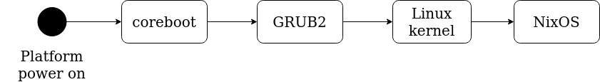
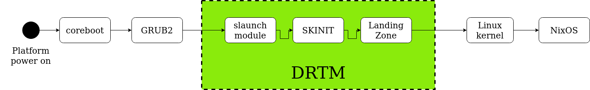

In [previous article](https://blog.3mdeb.com/2020/2020-03-31-trenchboot-nlnet-lz/)
I introduced project's basics. I explained briefly what parts of system are
necessary in DRTM and how to prepare them. Now, let's try to build them, so you
can enjoy having secure platform too. Also, we will verify first requirements
which are already met in project.

## Preparation

We are using PC Engines apu2 platform with coreboot and NixOS. Procedures which
are presented further in article are done for that exact configuration. If you
want to perform any operations step-by-step, I strongly recommend to use exactly
the same setup.

At this stage, I assume you have already installed NixOS according to our
[instructions](https://blog.3mdeb.com/2020/2020-03-31-trenchboot-nlnet-lz/#nixos-installation).
If yes, then we can start process of **enabling DRTM**.

### Qucik reminder - boot flow

Before we execute essential part, I would like to pass through quick reminder.
Don't worry, I won't give a lecture or bring unfamiliar concepts. I want to show
you differences between platform without DRTM and with DRTM. It is presented in
graphical form, so it will be easier to visualize it.

A normal boot process without DRTM enabled, typically looks like this:



GRUB bootloader **directly** loads Linux kernel and whereby NixOS boots. As you
know, by modifying GRUB, Linux kernel and adding special boot modules, we
enable DRTM. Then, the boot process looks like this:



You can clearly see 3 additional elements, which are **slaunch module**,
**SKINIT** and **Landing Zone**. Their functionality should be already known by
you. Briefly, it is DRTM stage, when platform boots.

Now, when you can visualize differences, you will learn how to switch your
platform from first case to second one. Let's do it!

## System customization - enabling DRTM

It is the first thing we need to do. Clean NixOS doesn't meet all requirements.
First of all, we want to replace default `nixpkgs` with our custom one. Second
of all, as it doesn't have all necessary packages installed by default, we want
to add them.

Fortunately, customization of NixOS will demand its **configuration update, but
not entire system re-installation**. Moreover, there is no need to install every
single package manually. Of course, it still can be done if you wish. However,
entire process of enabling DRTM is automated by us to minimize user's effort. So
much for the introduction - now we can finally run the procedure. Boot to NixOS
and follow these steps:

1. Install `cachix`

`cachix` is binary cache hosting. It allows to store binary files, so there is
no need to build them on your own. If it is not very useful for small builds, it
is very handy for large ones e.g. Linux kernel binary.

    ```bash
    $ nix-env -iA cachix -f https://cachix.org/api/v1/install
    ```

2. Add 3mdeb cachix hosting as default.

    ```bash
    $ cachix use 3mdeb
    Cachix configuration written to /etc/nixos/cachix.nix.
    Binary cache 3mdeb configuration written to /etc/nixos/cachix/3mdeb.nix.

    To start using cachix add the following to your /etc/nixos/configuration.nix:

        imports = [ ./cachix.nix ];

    Then run:

        $ sudo nixos-rebuild switch
    ```

Follow above request and add `imports = [ ./cachix.nix ];` to
`/etc/nixos/configuration.nix`.

3. Rebuild NixOS.

    ```
    $ sudo nixos-rebuild switch
    ```

4. Boot NixOS.

5. Install git package.

    ```bash
    $ nix-env -iA nixos.git
    ```

6. Clone
[3mdeb/nixpkgs](https://github.com/3mdeb/nixpkgs/tree/trenchboot_support_2020.03)
repository.

`3mdeb nixpkgs` contains additional packages compared with default NixOS
`nixpkgs`, so everything is in one place. Most of all, there are:

- [grub-tb](https://github.com/3mdeb/grub2/tree/trenchboot_support) - custom
  GRUB2 with `slaunch` module enabled;
- [landing-zone](https://github.com/TrenchBoot/landing-zone.git) - LZ without
  debug flag
- [landing-zone-debug](https://github.com/TrenchBoot/landing-zone.git) - LZ with
  debug
- [linux-5.1](https://github.com/3mdeb/linux-stable/tree/linux-sl-5.1-sha2-amd) -
  custom Linux kernel with initrd

    ```bash
    $ git clone https://github.com/3mdeb/nixpkgs.git -b trenchboot_support_2020.03
    (...)
    $ ls
    nixpkgs
    ```

7. Clone [3mdeb/nixos-trenchboot-configs](https://github.com/3mdeb/nixos-trenchboot-configs.git)
repository.

This repository contains all necessary NixOS configuration files in ready-to-use
form, so there is no need to edit them by hand at this moment.

    ```bash
    $ git clone https://github.com/3mdeb/nixos-trenchboot-configs.git
    ```

List `nixos-trenchboot-configs` folder.

    ```bash
    $ cd nixos-trenchboot-configs/
    $ ls
    configuration.nix  linux-5.1.nix  MANUAL.md  README.md  tb-config.nix
    ```

Among listed files, most interesting one is `configuration.nix`. Customizing it
saves time and work compared with tools and package manual installs. Manual work
is good for small and fast builds. The more (and more significant) changes you
want to do, the more efficient way is to re-build your NixOS system. That is
done by editing `configuration.nix` file. As you already know, among others we
want to rebuild Linux kernel, replace GRUB bootloader and install custom
packages. That is why we decided to prepare new config and re-install NixOS.

Let's take a closer look at its content. Entire file is rather large, so the
output will be truncated and only essential parts/lines will be mentioned.

    ```bash
    $ cat configuration.nix

    (...)
    imports =
      [ # Include the results of the hardware scan.
        ./hardware-configuration.nix
        ./cachix.nix
        ./linux-5.1.nix
      ];
    (...)
    boot.loader.grub.device = "/dev/sda"; # or "nodev" for efi only
    boot.loader.grub.extraEntries = ''
      menuentry "NixOS - Secure Launch" {
      search --set=drive1 --fs-uuid 178473b0-282f-4994-96fc-a8e51e2cfdac
      search --set=drive2 --fs-uuid 178473b0-282f-4994-96fc-a8e51e2cfdac
        slaunch skinit
        slaunch_module ($drive2)/boot/lz_header
        linux ($drive2)/nix/store/ymvcgas7b1bv76n35r19g4p142v4cr0b-linux-5.1.0/bzImage systemConfig=/nix/store/b32wgz392q99cls12pkd8adddzbdkprn-nixos-system-nixos-20.09.git.50c3e448fceM init=/nix/store/b32wgz392q99cls12pkd8adddzbdkprn-nixos-system-nixos-20.09.git.50c3e448fceM/init console=ttyS0,115200 earlyprintk=serial,ttyS0,115200 loglevel=4
        initrd ($drive2)/nix/store/zv2vl35xldkbss1y2fib1nifmw0yvick-initrd-linux-5.1.0/initrd
      }
    '';

    # OS utilities
    environment.systemPackages = [
                                   pkgs.pkg-config
                                   pkgs.git
                                   pkgs.gnumake
                                   pkgs.autoconf
                                   pkgs.automake
                                   pkgs.gettext
                                   pkgs.python
                                   pkgs.m4
                                   pkgs.libtool
                                   pkgs.bison
                                   pkgs.flex
                                   pkgs.gcc
                                   pkgs.gcc_multi
                                   pkgs.libusb
                                   pkgs.ncurses
                                   pkgs.freetype
                                   pkgs.qemu
                                   pkgs.lvm2
                                   pkgs.unifont
                                   pkgs.fuse
                                   pkgs.gnulib
                                   pkgs.stdenv
                                   pkgs.nasm
                                   pkgs.binutils
                                   pkgs.tpm2-tools
                                   pkgs.tpm2-tss
                                   pkgs.landing-zone
                                   pkgs.landing-zone-debug
                                   pkgs.grub-tb
                                  ];

    # Grub override
    nixpkgs.config.packageOverrides = pkgs: { grub2 = pkgs.grub-tb; };
    ```

Remarks:
  - we import `cachix` service and custom linux 5.1 kernel to be built;
  - adjust GRUB entries to boot `slaunch` and change directories of `bzImage`
  (Linux kernel) and `initrd` to custom ones;
  - add all necessary system packages (i.a. `landing-zone`, `landing-zone-debug`
  and `grub-tb`);
  - override default GRUB package with custom one;

8. Copy all configuration files to `/etc/nixos/` directory.

    ```bash
    $ cp nixos-trenchboot-configs/*.nix /etc/nixos
    ```

9. Update (or rather re-build) system.

    ```bash
    $ sudo nixos-rebuild switch -I nixpkgs=~/nixpkgs
    ```

> IMPORTANT: `-I nixpkgs=~/nixpkgs` flag is needful here! It replaces default
`nixpkgs` with previously downloaded one. Make sure the directory is valid (we
have it in home (~)). If you follow our instruction step-by-step, you have it
also there.

10. Reboot platform.

DRTM is not enabled yet! Boot to NixOS and finish configuration.

11. Install GRUB2-TrenchBoot to `/dev/sdX`.

    ```bash
    $ grub-install /dev/sda
    ```

Remember to choose proper device (disk) - in our case it is `/dev/sda`.

12. Ensure that `slaunch` modules are present in `/boot/grub/i386-pc/`.

    ```bash
    $ ls /boot/grub/i386-pc | grep slaunch
    slaunch.mod
    slaunch.module
    ```

13. Find Landing Zone package in `/nixos/store/`.

    ```bash
    $ ls /nix/store/ |grep landing-zone
    62ik61qxadavc2xix4sm8mbm0fcxlz2i-landing-zone-1.0
    ```

14. Copy `lz_header.bin` to `/boot/` directory.

    ```bash
    $ cp /nix/store/62ik61qxadavc2xix4sm8mbm0fcxlz2i-landing-zone-1.0/lz_header.bin /boot/lz_header
    ```

15. Check `/boot/grub/grub.cfg` file and its `NixOS - Default` menu entry.
Adjust `/etc/nixos/configuration.nix` and its `boot.loader.grub.extraEntries`
line to have exactly the same directories included.

    ```bash
    $ cat /boot/grub/grub.cfg
    (...)
    menuentry "NixOS - Default" {
    search --set=drive1 --fs-uuid 178473b0-282f-4994-96fc-a8e51e2cfdac
    search --set=drive2 --fs-uuid 178473b0-282f-4994-96fc-a8e51e2cfdac
      linux ($drive2)/nix/store/ymvcgas7b1bv76n35r19g4p142v4cr0b-linux-5.1.0/bzImage systemConfig=/nix/store/b32wgz392q99cls12pkd8adddzbdkprn-nixos-system-nixos-20.09.git.50c3e448fceM init=/nix/store/b32wgz392q99cls12pkd8adddzbdkprn-nixos-system-nixos-20.09.git.50c3e448fceM/init console=ttyS0,115200 earlyprintk=serial,ttyS0,115200 loglevel=4
      initrd ($drive2)/nix/store/zv2vl35xldkbss1y2fib1nifmw0yvick-initrd-linux-5.1.0/initrd
    }
    (...)
    ```

With `grub.cfg` content as above `configuration.nix` must have
`boot.loader.grub.extraEntries `line like this:

    ```bash
    $ cat /etc/nixos/configuration.nix
      (...)
      boot.loader.grub.extraEntries = ''
      menuentry "NixOS - Secure Launch" {
      search --set=drive1 --fs-uuid 178473b0-282f-4994-96fc-a8e51e2cfdac
      search --set=drive2 --fs-uuid 178473b0-282f-4994-96fc-a8e51e2cfdac
        slaunch skinit
        slaunch_module ($drive2)/boot/lz_header
        linux ($drive2)/nix/store/ymvcgas7b1bv76n35r19g4p142v4cr0b-linux-5.1.0/bzImage systemConfig=/nix/store/b32wgz392q99cls12pkd8adddzbdkprn-nixos-system-nixos-20.09.git.50c3e448fceM init=/nix/store/b32wgz392q99cls12pkd8adddzbdkprn-nixos-system-nixos-20.09.git.50c3e448fceM/init console=ttyS0,115200 earlyprintk=serial,ttyS0,115200 loglevel=4
        initrd ($drive2)/nix/store/zv2vl35xldkbss1y2fib1nifmw0yvick-initrd-linux-5.1.0/initrd
      }
    '';
    ```

If there are differences in any of `search --set=drive1...`, `search
--set=drive2...`, `linux ($drive2)/nix/store...` lines. Edit
`configuration.nix` content and copy those lines from `grub.cfg`.

16. Update system again.

    ```bash
    $ sudo nixos-rebuild switch -I nixpkgs=~/nixpkgs
    ```

17. Reboot platform.

During platform booting, in GRUB menu there should be at least `"NixOS -
Default"` and `"NixOS - Secure Launch"` entries. First entry boots platform
without DRTM. Second entry **executes DRTM**! Choose the second entry and see if
platform boots successfully. If yes, you have secure platform with DRTM enabled.

## Validation

You can still be suspicious, if it really works. And rightly so. In this
section, I will show you, how to verify each component of the system to make you
sure about its correctness. Also, I will present how we met first stage
project's requirement.

### GRUB

There are two ways to validate if GRUB will load `slaunch` module and hence run
SKINIT and LZ (DRTM).

##### Verify content of `grub.cfg` file.

    ```
    $ cat /boot/grub/grub.cfg
    menuentry "NixOS - Secure Launch" {
    search --set=drive1 --fs-uuid babbf771-2766-4f6e-9a1f-7752464a6d37
    search --set=drive2 --fs-uuid babbf771-2766-4f6e-9a1f-7752464a6d37
      slaunch skinit
      slaunch_module ($drive2)/boot/lz_header
      linux ($drive2)/nix/store/ymvcgas7b1bv76n35r19g4p142v4cr0b-linux-5.1.0/bzImage systemConfig=/nix/store/j6l74m01hh5hkargzdbwzhpsdhgzwsgp-nix4
      initrd ($drive2)/nix/store/n28axzys9kh4d4rvnpxv38pparzmkcfi-initrd-linux-5.1.0/initrd

    }
    ```

There must be `slaunch skinit` entry and `slaunch_module
($drive2)/boot/lz_header` which points to LZ.

##### Compare bootlog with DRTM and without DRTM

1. Reboot platform. In GRUB menu choose `"NixOS - Default"` entry. Verify logs.

>This entry should execute Linux kernel. DRTM shouldn't execute.

    ```
    early console in extract_kernel
    input_data: 0x00000000023eb3b1
    input_len: 0x0000000000424e94
    output: 0x0000000001000000
    output_len: 0x00000000017e7398
    kernel_total_size: 0x000000000142c000
    trampoline_32bit: 0x000000000009d000
    booted via startup_32()
    Physical KASLR using RDTSC...
    Virtual KASLR using RDTSC...

    Decompressing Linux... Parsing ELF... Performing relocations... done.
    Booting the kernel.
    [    0.000000] Linux version 5.1.0 (nixbld@localhost) (gcc version 9.2.0 (GCC)) #1-NixOS SMP Thu Jan 1 00:00:01 UTC 1970
    [    0.000000] Command line: BOOT_IMAGE=(hd0,msdos1)/nix/store/ymvcgas7b1bv76n35r19g4p142v4cr0b-linux-5.1.0/bzImage systemConfig=/nix/store/74
    [    0.000000] x86/fpu: Supporting XSAVE feature 0x001: 'x87 floating point registers'

    (...)

    <<< Welcome to NixOS 20.09.git.a070e686875 (x86_64) - ttyS0 >>>

    Run 'nixos-help' for the NixOS manual.
    ```

As expected, bootloader executes Linux kernel directly. Platform booted without
DRTM then.

2. Reboot platform once again. In GRUB menu choose `"NixOS - Secure Launch"`
entry and verify logs.

    ```
    grub_cmd_slaunch:122: check for manufacturer
    grub_cmd_slaunch:126: check for cpuid
    grub_cmd_slaunch:136: set slaunch
    grub_cmd_slaunch_module:156: check argc
    grub_cmd_slaunch_module:161: check relocator
    grub_cmd_slaunch_module:170: open file
    grub_cmd_slaunch_module:175: get size
    grub_cmd_slaunch_module:180: allocate memory
    grub_cmd_slaunch_module:192: addr: 0x100000
    grub_cmd_slaunch_module:194: target: 0x100000
    grub_cmd_slaunch_module:196: add module
    grub_cmd_slaunch_module:205: read file
    grub_cmd_slaunch_module:215: close file
    grub_slaunch_boot_skinit:41: real_mode_target: 0x8a000
    grub_slaunch_boot_skinit:42: prot_mode_target: 0x1000000
    grub_slaunch_boot_skinit:43: params: 0xcfe7745early console in extract_kernel
    input_data: 0x00000000023eb3b1
    input_len: 0x0000000000424e94
    output: 0x0000000001000000
    output_len: 0x00000000017e7398
    kernel_total_size: 0x000000000142c000
    trampoline_32bit: 0x000000000009d000
    booted via startup_32()
    Physical KASLR using RDTSC...
    Virtual KASLR using RDTSC...

    Decompressing Linux... Parsing ELF... Performing relocations... done.
    Booting the kernel.
    [    0.000000] Linux version 5.1.0 (nixbld@localhost) (gcc version 9.2.0 (GCC)) #1-NixOS SMP Thu Jan 1 00:00:01 UTC 1970
    [    0.000000] Command line: BOOT_IMAGE=(hd0,msdos1)/nix/store/ymvcgas7b1bv76n35r19g4p142v4cr0b-linux-5.1.0/bzImage systemConfig=/nix/store/j4
    [    0.000000] x86/fpu: Supporting XSAVE feature 0x001: 'x87 floating point registers'

    (...)

    <<< Welcome to NixOS 20.09.git.a070e686875 (x86_64) - ttyS0 >>>

    Run 'nixos-help' for the NixOS manual.
    ```

As expected, before Linux kernel, there should be `slaunch` module executed. It
proves that DRTM is enabled. There is no information about LZ execution because
it is non-debug version.

### Landing Zone

Actually, there are few aspects which can be verified in LZ. We will focus on
those two:
- check if LZ utilizes SHA256 algorithm when using TPM2.0 module
- check if LZ debug option can be enabled

##### check if LZ utilizes SHA256 algorithm when using TPM2.0 module

1. Reboot platform and boot to NixOS via `"NixOS - Secure Launch"` entry in GRUB
menu.

2. Run `tpm2_pcrread` command.

    ```
    $ tpm2_pcrread
    sha1:
      0 : 0x3A3F780F11A4B49969FCAA80CD6E3957C33B2275
      1 : 0xFE4F0F826A15FA9E426722AAE12731508D84110D
      2 : 0x53DE584DCEF03F6A7DAC1A240A835893896F218D
      3 : 0x3A3F780F11A4B49969FCAA80CD6E3957C33B2275
      4 : 0x017A3DE82F4A1B77FC33A903FEF6AD27EE92BE04
      5 : 0xE8D30FFC7365EB05A2B87BFBE70093D385468A73
      6 : 0x3A3F780F11A4B49969FCAA80CD6E3957C33B2275
      7 : 0x3A3F780F11A4B49969FCAA80CD6E3957C33B2275
      8 : 0x0000000000000000000000000000000000000000
      9 : 0x0000000000000000000000000000000000000000
      10: 0x0000000000000000000000000000000000000000
      11: 0x0000000000000000000000000000000000000000
      12: 0x0000000000000000000000000000000000000000
      13: 0x0000000000000000000000000000000000000000
      14: 0x0000000000000000000000000000000000000000
      15: 0x0000000000000000000000000000000000000000
      16: 0x0000000000000000000000000000000000000000
      17: 0xDAF9803F6DA7FA4E20BB13F9A08FFC2C976DE19E
      18: 0x0000000000000000000000000000000000000000
      19: 0x0000000000000000000000000000000000000000
      20: 0x0000000000000000000000000000000000000000
      21: 0x0000000000000000000000000000000000000000
      22: 0x0000000000000000000000000000000000000000
      23: 0x0000000000000000000000000000000000000000
    sha256:
      0 : 0xD27CC12614B5F4FF85ED109495E320FB1E5495EB28D507E952D51091E7AE2A72
      1 : 0xF4CE533757FFD1AA737A15D0D6804CAFEBE9FF2B507C696709557E72E49FFD34
      2 : 0xFA8791BB6BCE8EBF4AD7B516ADFBBB9B2F1499A8876E2C909135AEBDCCA2D84C
      3 : 0xD27CC12614B5F4FF85ED109495E320FB1E5495EB28D507E952D51091E7AE2A72
      4 : 0x94855A1DF928211EAB2000178968B4B630B9BAC53B4C34177EE5224E9AAF2304
      5 : 0xADBE04E4DD6F3E4502B6FE31B408C9AF61CA9BD830AED12F5A8EBB4FF87374D1
      6 : 0xD27CC12614B5F4FF85ED109495E320FB1E5495EB28D507E952D51091E7AE2A72
      7 : 0xD27CC12614B5F4FF85ED109495E320FB1E5495EB28D507E952D51091E7AE2A72
      8 : 0x0000000000000000000000000000000000000000000000000000000000000000
      9 : 0x0000000000000000000000000000000000000000000000000000000000000000
      10: 0x0000000000000000000000000000000000000000000000000000000000000000
      11: 0x0000000000000000000000000000000000000000000000000000000000000000
      12: 0x0000000000000000000000000000000000000000000000000000000000000000
      13: 0x0000000000000000000000000000000000000000000000000000000000000000
      14: 0x0000000000000000000000000000000000000000000000000000000000000000
      15: 0x0000000000000000000000000000000000000000000000000000000000000000
      16: 0x0000000000000000000000000000000000000000000000000000000000000000
      17: 0xAF0B77BE672630F6F5CA46E985D9A2FEFBEE44E5F1245E5C93874801902B7E82
      18: 0x7D40EF53445C25EE0A0465ABECC762BBD35FE7854B0E58136B0FF3537607F510
      19: 0x0000000000000000000000000000000000000000000000000000000000000000
      20: 0x0000000000000000000000000000000000000000000000000000000000000000
      21: 0x0000000000000000000000000000000000000000000000000000000000000000
      22: 0x0000000000000000000000000000000000000000000000000000000000000000
      23: 0x0000000000000000000000000000000000000000000000000000000000000000
    ```

3. Run `extend_all.sh` script from `landing-zone` package.

This script simulates what should be extended into PCR17 by SKINIT, LZ and
kernel during platform booting. It extends both SHA256 and SHA1 values. However,
expected result is valid only for SHA256.

To properly execute script, first find correct directory to `bzImage` and
`initrd`. Best way to find exact directories is to see `"NixOS - Secure Launch"`
entry in `/boot/grub/grub.cfg`:

    ```
    $ cat /boot/grub/grub.cfg
    (...)
    menuentry "NixOS - Secure Launch" {
    search --set=drive1 --fs-uuid babbf771-2766-4f6e-9a1f-7752464a6d37
    search --set=drive2 --fs-uuid babbf771-2766-4f6e-9a1f-7752464a6d37
      slaunch skinit
      slaunch_module ($drive2)/boot/lz_header
      linux ($drive2)/nix/store/ymvcgas7b1bv76n35r19g4p142v4cr0b-linux-5.1.0/bzImage systemConfig=/nix/store/j6l74m01hh5hkargzdbwzhpsdhgzwsgp-nix4
      initrd ($drive2)/nix/store/n28axzys9kh4d4rvnpxv38pparzmkcfi-initrd-linux-5.1.0/initrd

    }
    (...)
    ```

`/nix/store/ymvcgas7b1bv76n35r19g4p142v4cr0b-linux-5.1.0/bzImage` is directory
to Linux kernel.
`/nix/store/n28axzys9kh4d4rvnpxv38pparzmkcfi-initrd-linux-5.1.0/initrd` is
directory to initrd.

4. Go to `/nix/store/` and run below command:

    ```
    $ cd /nix/store
    $ ls | grep landing-zone
    1innc3mrv551bl5966ifji1pksm7awf3-landing-zone-1.0.drv
    1xrqa59gwzabwdq5nq8na0dp8z83p1jd-landing-zone-1.0
    7xi03wjy790y1hhl4hl6rpgcknhddq7b-landing-zone-1.0.drv
    m3g83lg5wwqpyq3c59mm1w7va9942hzx-landing-zone-1.0
    ```

>Hash before `-landing-zone-1.0` is dependent on built version and might be
different in yours.

5. Go to `/nix/store/m3g83lg5wwqpyq3c59mm1w7va9942hzx-landing-zone-1.0`
directory.

    ```
    $ cd /nix/store/m3g83lg5wwqpyq3c59mm1w7va9942hzx-landing-zone-1.0
    ```

6. Execute `./extend_all.sh` script.

Usage is `./extend_all.sh <directory-to-bzImage> <directory-to-initrd>`

    ```
    ./extend_all.sh /nix/store/ymvcgas7b1bv76n35r19g4p142v4cr0b-linux-5.1.0/bzImage /nix/store/n28axzys9kh4d4rvnpxv38pparzmkcfi-initrd-linux-5.1.0/initrd
    f3349f3aead2913843b2b3bbfc6c87597bfd7d6c  SHA1
    af0b77be672630f6f5ca46e985d9a2fefbee44e5f1245e5c93874801902b7e82  SHA256
    ```

Compare SHA256 value with PCR17 content checked previously with `tpm2_pcrread`
output. If DRTM is enabled and executes properly, they should be the same. It
proves that LZ code utilizes SHA256 algorithm during measurements.

##### Check if LZ debug option can be enabled

1. Boot NixOS and go to `/nix/store/` directory.

    ```
    $ cd /nix/store/
    ```

2. Find landing-zone package (without debug).

    ```
    # ls /nix/store/ | grep landing-zone
    1innc3mrv551bl5966ifji1pksm7awf3-landing-zone-1.0.drv
    1xrqa59gwzabwdq5nq8na0dp8z83p1jd-landing-zone-1.0
    7xi03wjy790y1hhl4hl6rpgcknhddq7b-landing-zone-1.0.drv
    m3g83lg5wwqpyq3c59mm1w7va9942hzx-landing-zone-1.0
    ```

3. Copy `lz_header.bin` from proper directory to `/boot` directory.

    ```
    cp /nix/store/m3g83lg5wwqpyq3c59mm1w7va9942hzx-landing-zone-1.0/lz_header.bin /boot/lz_header
    ```

4. Reboot platform and choose `"NixOS - Secure Launch"` entry in GRUB. Verify
bootlog.

    ```
    grub_cmd_slaunch:122: check for manufacturer
    grub_cmd_slaunch:126: check for cpuid
    grub_cmd_slaunch:136: set slaunch
    grub_cmd_slaunch_module:156: check argc
    grub_cmd_slaunch_module:161: check relocator
    grub_cmd_slaunch_module:170: open file
    grub_cmd_slaunch_module:175: get size
    grub_cmd_slaunch_module:180: allocate memory
    grub_cmd_slaunch_module:192: addr: 0x100000
    grub_cmd_slaunch_module:194: target: 0x100000
    grub_cmd_slaunch_module:196: add module
    grub_cmd_slaunch_module:205: read file
    grub_cmd_slaunch_module:215: close file
    grub_slaunch_boot_skinit:41: real_mode_target: 0x8a000
    grub_slaunch_boot_skinit:42: prot_mode_target: 0x1000000
    grub_slaunch_boot_skinit:43: params: 0xcfe7745early console in extract_kernel
    input_data: 0x00000000023eb3b1
    input_len: 0x0000000000424e94
    output: 0x0000000001000000
    output_len: 0x00000000017e7398
    kernel_total_size: 0x000000000142c000
    trampoline_32bit: 0x000000000009d000
    booted via startup_32()
    Physical KASLR using RDTSC...
    Virtual KASLR using RDTSC...

    Decompressing Linux... Parsing ELF... Performing relocations... done.
    Booting the kernel.
    [    0.000000] Linux version 5.1.0 (nixbld@localhost) (gcc version 9.2.0 (GCC)) #1-NixOS SMP Thu Jan 1 00:00:01 UTC 1970
    [    0.000000] Command line: BOOT_IMAGE=(hd0,msdos1)/nix/store/ymvcgas7b1bv76n35r19g4p142v4cr0b-linux-5.1.0/bzImage systemConfig=/nix/store/j4
    [    0.000000] x86/fpu: Supporting XSAVE feature 0x001: 'x87 floating point registers'

    (...)

    <<< Welcome to NixOS 20.09.git.a070e686875 (x86_64) - ttyS0 >>>

    Run 'nixos-help' for the NixOS manual.
    ```

5. Go to `/nix/store/` directory.

    ```
    $ cd /nix/store/
    ```

6. Find landing-zone package (with debug).

    ```
    # ls /nix/store/ | grep landing-zone
    1innc3mrv551bl5966ifji1pksm7awf3-landing-zone-1.0.drv
    1xrqa59gwzabwdq5nq8na0dp8z83p1jd-landing-zone-1.0
    7xi03wjy790y1hhl4hl6rpgcknhddq7b-landing-zone-1.0.drv
    m3g83lg5wwqpyq3c59mm1w7va9942hzx-landing-zone-1.0
    ```

7. Copy `lz_header.bin` from above directory to `/boot` directory.

    ```
    cp /nix/store/1xrqa59gwzabwdq5nq8na0dp8z83p1jd-landing-zone-1.0/lz_header.bin /boot/lz_header
    ```

8. Reboot platform and choose `"NixOS - Secure Launch"` entry in GRUB. Verify
bootlog.

    ```
    grub_cmd_slaunch:122: check for manufacturer
    grub_cmd_slaunch:126: check for cpuid
    grub_cmd_slaunch:136: set slaunch
    grub_cmd_slaunch_module:156: check argc
    grub_cmd_slaunch_module:161: check relocator
    grub_cmd_slaunch_module:170: open file
    grub_cmd_slaunch_module:175: get size
    grub_cmd_slaunch_module:180: allocate memory
    grub_cmd_slaunch_module:192: addr: 0x100000
    grub_cmd_slaunch_module:194: target: 0x100000
    grub_cmd_slaunch_module:196: add module
    grub_cmd_slaunch_module:205: read file
    grub_cmd_slaunch_module:215: close file
    grub_slaunch_boot_skinit:41: real_mode_target: 0x8a000
    grub_slaunch_boot_skinit:42: prot_mode_target: 0x1000000
    grub_slaunch_boot_skinit:43: params: 0xcfe7745sl_stub_entry_offset:
    0x00000000014318a8: d0 01 00 00 00 00 00 00 00 00 00 00 00 00 00 00   ................
    0x00000000014318b8: 23 02 00 00 00 00 00 00 00 00 00 00 66 66 2e 0f   #...........ff..
    0x00000000014318c8: 1f 84 00 00 00 00 00 90 fa fc 8d a5 c4 9c 43 00   ..............C.
    0x00000000014318d8: 01 ad 72 6c 43 00 0f 01 95 70 6c 43 00 b8 10 00   ..rlC....plC....
    0x00000000014318e8: 00 00 8e d8 8e c0 8e e0 8e e8 8e d0 8d 85 fe 18   ................
    0x00000000014318f8: 43 00 6a 08 50 cb b9 1b 00 00 00 0f 32 a9 00 01   C.j.P.......2...
    0x0000000001431908: 00 00 75 02 0f 0b bf 01 00 00 00 31 c0 0f a2 81   ..u........1....
    0x0000000001431918: fb 47 65 6e 75 0f 85 82 00 00 00 81 fa 69 6e 65   .Genu........ine
    0x0000000001431928: 49 75 7a 81 f9 6e 74 65 6c 75 72 bf 02 00 00 00   Iuz..ntelur.....
    0x0000000001431938: c7 85 b0 6c 43 00 02 00 00 00 ff 85 bc 6c 43 00   ...lC........lC.
    0x0000000001431948: 31 db b8 07 00 00 00 0f 37 8d 85 5c 19 43 00 9c   1.......7..\.C..
    0x0000000001431958: 6a 08 50 cf c7 05 30 00 d2 fe 00 00 00 00 c7 05   j.P...0.........
    0x0000000001431968: 08 00 d2 fe ff ff ff ff a1 00 03 d2 fe 8b 08 8d   ................
    0x0000000001431978: 44 08 08 8b 70 04 89 a8 34 02 00 00 8b b8 3c 02   D...p...4.....<.
    0x0000000001431988: 00 00 89 bd c0 6c 43 00 50 56 e8 e9 00 00 00 5e   .....lC.PV.....^
    0x0000000001431998: e8 c3 01 00 00 5f e8 5d 01 00 00 eb 0e c7 85 b0   ....._.]........
    shasum calculated:
    0x00000000001001b0: ed a5 f1 9e 28 0e d8 b3 5a de bc b6 e7 15 c8 de   ....(...Z.......
    0x00000000001001c0: 1f bb 2c aa f2 8a af c8 a0 2f d3 60 d5 d0 78 a1   ..,....../.`..x.
    PCR extended
    pm_kernel_entry:
    0x00000000010001d0: 8d ab 30 fe ff ff e9 f5 16 43 00 00 00 00 00 00   ..0......C......
    0x00000000010001e0: 00 00 00 00 00 00 00 00 00 00 00 00 00 00 00 00   ................
    ...
    0x0000000001000200: 31 c0 8e d8 8e c0 8e d0 8e e0 8e e8 48 8d 2d ed   1...........H.-.
    0x0000000001000210: fd ff ff 8b 86 30 02 00 00 ff c8 48 01 c5 48 f7   .....0.....H..H.
    0x0000000001000220: d0 48 21 c5 48 81 fd 00 00 00 01 7d 07 48 c7 c5   .H!.H......}.H..
    0x0000000001000230: 00 00 00 01 8b 9e 60 02 00 00 81 eb 00 60 46 00   ......`......`F.
    0x0000000001000240: 48 01 eb 48 8d a3 40 de 44 00 48 31 c0 e8 00 00   H..H..@.D.H1....
    0x0000000001000250: 00 00 5f 48 81 ef 52 02 00 00 e8 3e 50 42 00 48   .._H..R....>PB.H
    0x0000000001000260: 8d 05 e4 68 43 00 48 89 05 d5 68 43 00 0f 01 15   ...hC.H...hC....
    0x0000000001000270: cc 68 43 00 56 48 89 f7 e8 b3 a9 42 00 5e 48 89   .hC.VH.....B.^H.
    0x0000000001000280: c1 48 8d 3d 0c 00 00 00 6a 08 48 8d 80 00 10 00   .H.=....j.H.....
    0x0000000001000290: 00 50 48 cb 48 8d a3 40 de 44 00 56 48 8d bb 00   .PH.H..@.D.VH...
    0x00000000010002a0: 50 46 00 e8 c8 ab 42 00 5e 6a 00 9d e8 00 00 00   PF....B.^j......
    0x00000000010002b0: 00 58 48 2d b1 02 00 00 48 89 df e8 dd 4f 42 00   .XH-....H....OB.
    0x00000000010002c0: 56 48 8d 35 70 9b 43 00 48 8d bb 38 9e 43 00 48   VH.5p.C.H..8.C.H
    zero_page:
    0x000000000008a000: 00 0d 00 80 00 00 03 50 00 00 00 00 00 00 19 01   .......P........
    0x000000000008a010: 10 00 00 00 00 00 00 00 00 00 00 00 00 00 00 00   ................
    0x000000000008a020: 3f a3 00 10 00 00 00 00 00 00 00 00 00 00 00 00   ?...............
    0x000000000008a030: 00 00 00 00 00 00 00 00 00 00 00 00 00 00 00 00   ................
    ...
    0x000000000008a0d0: 00 00 00 00 00 00 00 00 00 a0 10 00 00 00 00 00   ................
    0x000000000008a0e0: 00 00 00 00 00 00 00 00 00 00 00 00 00 00 00 00   ................
    ...
    lz_base:
    0x0000000000100000: d4 01 00 d0 00 00 00 00 00 00 00 00 00 00 00 00   ................
    0x0000000000100010: 00 00 00 00 00 00 00 00 00 00 00 00 00 00 00 00   ................
    ...
    0x0000000000100060: 19 19 10 00 00 00 00 00 00 00 00 00 00 00 00 00   ................
    0x0000000000100070: b0 00 10 00 00 00 00 00 40 00 00 00 aa f3 e2 dc   ........@.......
    0x0000000000100080: 00 29 10 00 00 00 00 00 1a 13 e2 aa 1d af ab 59   .).............Y
    0x0000000000100090: cc 8e 1e 1c 68 42 f8 12 28 01 10 00 00 00 00 00   ....hB..(.......
    0x00000000001000a0: b3 e1 3a e9 08 00 00 00 58 01 10 00 00 00 00 00   ..:.....X.......
    0x00000000001000b0: 4b 88 d2 cb 27 91 a5 53 bb 49 64 ae 32 40 a6 ce   K...'..S.Id.2@..
    0x00000000001000c0: aa a1 96 a1 e6 b4 6c df 8e b7 83 ee 2c 13 aa 8f   ......l.....,...
    0x00000000001000d0: 98 5a cb bb b0 64 34 b3 5f 8c 20 28 a7 52 64 06   .Z...d4._. (.Rd.
    0x00000000001000e0: d1 b4 50 95 e6 2b 8f b2 4d 33 a4 80 ca e5 7d 48   ..P..+..M3....}H
    0x00000000001000f0: 30 01 10 00 00 00 00 00 b0 01 10 00 00 00 00 00   0...............
    early console in extract_kernel
    input_data: 0x00000000023eb3b1
    input_len: 0x0000000000424e94
    output: 0x0000000001000000
    output_len: 0x00000000017e7398
    kernel_total_size: 0x000000000142c000
    trampoline_32bit: 0x000000000009d000
    booted via startup_32()
    Physical KASLR using RDTSC...
    Virtual KASLR using RDTSC...

    Decompressing Linux... Parsing ELF... Performing relocations... done.
    Booting the kernel.
    [    0.000000] Linux version 5.1.0 (nixbld@localhost) (gcc version 9.2.0 (GCC)) #1-NixOS SMP Thu Jan 1 00:00:01 UTC 1970
    [    0.000000] Command line: BOOT_IMAGE=(hd0,msdos1)/nix/store/ymvcgas7b1bv76n35r19g4p142v4cr0b-linux-5.1.0/bzImage systemConfig=/nix/store/j4
    [    0.000000] x86/fpu: Supporting XSAVE feature 0x001: 'x87 floating point registers'
    ```

As you can see, debug output is more verbose then previous one. It has
additional information about e.g. LZ, zero page etc. However, I recommend to use
non-debug LZ in normal operation.

Above procedure proves that LZ is available in debug and non-debug version. Both
can be easily adopted by user in NixOS.

## Summary

With theoretical knowledge and now also practice you should be able to enable
DRTM on your platform and verify its operations. Further development will bring
more features. Each of them will be presented in similar way. Each of them also
will be verifiable by you. So stay tuned and follow our social media for more
information!

If you think we can help in improving the security of your firmware or you
looking for someone who can boost your product by leveraging advanced features
of used hardware platform, feel free to [book a call with us](https://calendly.com/3mdeb/consulting-remote-meeting)
or drop us email to `contact<at>3mdeb<dot>com`. If you are interested in similar
content feel free to [sign up to our newsletter](http://eepurl.com/gfoekD)
