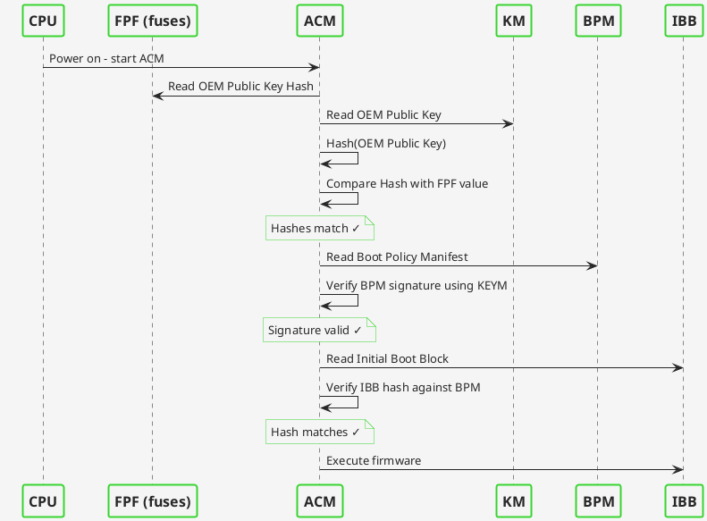
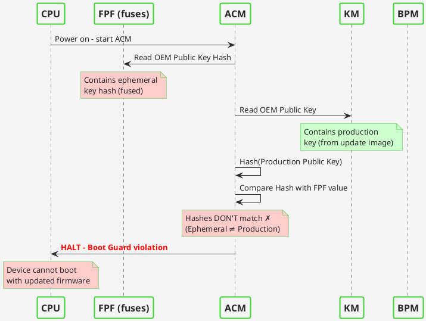

## Introduction

> **Note:** For affected users seeking immediate guidance, please refer to
> [Dasharo Security Bulletin DSB-001](https://github.com/3mdeb/3mdeb-secpack/blob/master/DSBs/dsb-001-2025.txt).
> This blog post provides additional technical context and details.

This report serves as a disclosure and post-mortem analysis of a critical
incident identified on 5th December 2025 affecting Dasharo firmware for
NovaCustom V540TU and V560TU platforms. A release engineering error resulted in
firmware binaries signed with an ephemeral testing key being published for the
Dasharo TrustRoot fusing operation instead of binaries signed with the
production key.

Users who performed the fusing operation between 24th October and 5th December
2025 may have irreversibly written the wrong cryptographic key hash into their
SoC's Field Programmable Fuses (FPF). Because these fuses are One-Time
Programmable and the ephemeral key's private component is no longer accessible,
affected devices cannot receive future firmware updates.

This document provides a technical breakdown of what happened, why software
recovery is impossible, and the corrective measures implemented to prevent
recurrence.

## The role of Dasharo Tools Suite

The Dasharo Tools Suite (DTS) is the vehicle for delivering and maintaining
Dasharo firmware updates. Built as a minimal Linux distribution based on the
Yocto Project, DTS boots directly on the target hardware to perform low-level
maintenance tasks that are often impossible from within a standard operating
system. It interfaces with the SPI flash controller, the Embedded Controller
(EC), and the Intel Management Engine.

One of the recently added DTS features is
[fusing the device vendor keys](https://docs.dasharo.com/dasharo-tools-suite/documentation/features/#fusing-the-device-vendor-keys).

The fusing operation involves writing to One-Time Programmable (OTP) registers
within the chipset. The design of DTS aims to abstract the immense complexity
of this operation, wrapping the complex and potentially dangerous tasks into a
user-friendly workflow. In this incident, DTS executed the fusing operation
correctly according to its design, but the firmware binary it was instructed to
use had been incorrectly selected by the release engineer.

## The concept of owner-controlled security

The incident highlights the inherent risks of owner-controlled security. In a
traditional firmware deployment model, the vendor manages the keys, the fusing,
and the updates. In the Dasharo model, the user has the ability to choose. When
a user chooses to fuse their platform, they are essentially performing a final
assembly factory procedure on their own desk. They are instructing the silicon
to reject any code that does not match the cryptographic signature of the
vendor (in this case: NovaCustom). This places a large burden of reliability on
the supply chain delivering the payload for that operation. The failure
discussed here was a breach of that reliability.

## Technical background: Intel Boot Guard

Intel Boot Guard is a hardware-assisted root of trust that prevents firmware
compromise before the OS loads. The architecture relies on Field Programmable
Fuses (FPF) in the Platform Controller Hub - One-Time Programmable e-fuses that
store a SHA-384 hash of the OEM's RSA public key (the OEM Public Key Hash).
Once programmed, these fuses cannot be reverted, providing immutable hardware
security. You can refer to
[Intel documentation](https://www.intel.com/content/www/us/en/developer/articles/technical/software-security-guidance/resources/key-usage-in-integrated-firmware-images.html)
for more details.

Key points in the verification chain:

1. The CPU's Authenticated Code Module (ACM) reads the Key Manifest (KEYM) from
   firmware, hashes the public key it contains, and compares it to the FPF
   value
2. If the hashes match, the ACM trusts the KEYM and proceeds to verify the Boot
   Policy Manifest (BPM), which is signed by that key
3. The BPM defines the boot policy and contains hashes of the Initial Boot
   Block (IBB)
4. Only firmware matching this chain of trust will execute

<div style="margin: 4em 1em 2em 1em">
  
  <figcaption style="text-align: center;">
    Firmware verification flow of Intel Boot Guard - normal operation
  </figcaption>
</div>

<!--

Diagram source:



-->

During manufacturing, devices operate in "Manufacturing Mode" where FPFs are
emulated and changeable. Dasharo TrustRoot fusing writes the OEM Public Key
Hash to the FPFs and sets the End of Manufacturing (EOM) bit, which permanently
locks the fuses and enforces the Boot Guard policy on all subsequent boots.

<div style="margin: 4em 1em 2em 1em">
  
  <figcaption style="text-align: center;">
    Transition from Manufacturing Mode to Production Mode via Dasharo TrustRoot fusing
  </figcaption>
</div>

<!--

Diagram source:

```plantuml
@startuml
!define Color1 #38d430
!define Color2 #272727
!define Color3 #f5f5f5

skinparam {
    DefaultFontColor Color2
    BackgroundColor Color3
    ArrowColor Color2
    ActorBorderColor Color1
    ActorBackgroundColor Color3
    ActorFontColor Color2
    ParticipantBorderColor Color1
    ParticipantBackgroundColor Color3
    ParticipantFontColor Color2
    LifeLineBorderColor Color1
    LifeLineBackgroundColor Color3
    SequenceGroupBorderColor Color1
    SequenceGroupBackgroundColor Color3
    SequenceGroupFontColor Color2
    BoxBorderColor Color1
    BoxBackgroundColor Color3
    BoxFontColor Color2
    NoteBackgroundColor Color3
    NoteBorderColor Color1
    NoteFontColor Color2
    TitleBorderColor Color1
    TitleBackgroundColor Color3
    TitleFontColor Color2
    DividerBackgroundColor Color3
    DividerBorderColor Color1
    DividerFontColor Color2
}

skinparam sequence {
    DividerBackgroundColor Color3
    DividerBorderColor Color1
    DividerFontColor Color2
    ArrowBackgroundColor Color3
    ParticipantPadding 20
    ParticipantBorderThickness 2
    ParticipantFontSize 16
    ParticipantFontStyle bold
}

participant "User" as User
participant "DTS" as DTS
participant "SPI Flash" as Flash
participant "CPU/ME" as ME
participant "FPF" as FPF

note over FPF #ffffcc: Manufacturing Mode:\nFPFs emulated, changeable

User -> DTS: Select "Dasharo TrustRoot Fusing"
DTS -> DTS: Download EOM-enabled\nfirmware binary\n
  (contains production key\n in Key Manifest)
note over DTS: Binary has EOM bit\nalready configured
DTS -> Flash: Flash firmware binary to SPI
DTS -> User: Flash complete, reboot required
User -> ME: Reboot device
note over ME,Flash: First boot with\nEOM-enabled firmware
ME -> Flash: Read Key Manifest (KEYM)\nfrom firmware
ME -> ME: Extract OEM Public Key\nfrom KEYM
ME -> ME: Calculate SHA-384 hash\nof OEM Public Key
ME -> ME: Detect EOM bit set in firmware
note over FPF,ME #ffcccc: <b>Point of No Return:</b>\nME automatically fuses FPFs
ME -> FPF: Write OEM Public Key Hash
ME -> FPF: Lock FPFs permanently
note over FPF #ffcccc: Production Mode:\n
  FPFs locked, immutable,\nBoot Guard enforcement active
ME -> ME: Continue boot process

@enduml
```

-->

## What went wrong

The NovaCustom firmware release process involves coordination between 3mdeb
(development) and NovaCustom (production key custody). The production key is
held by NovaCustom as a security measure, ensuring the vendor retains control
over the hardware trust anchor. During development, binaries are signed with
ephemeral keys to verify Boot Guard functionality before final production
signing.

The failure occurred during artifact publication. A release engineer uploading
the binary for Dasharo TrustRoot fusing inadvertently selected a file signed
with an ephemeral key due to filename similarity. Despite standard release
protocols, a manual oversight occurred during the final publication step,
leading to the incorrect binary being distributed.

Once users performed the fusing operation, the FPFs were irreversibly
programmed with the ephemeral key's hash. Because the ephemeral key was a
temporary artifact (since deleted), future firmware updates cannot be signed
with it.

Updating with a binary signed by a key that mismatches the fused key will
result in a brick. As a result, the device is permanently rendered
unmaintainable and non-compliant with security standards, making it effectively
unfit for professional use. To restore the device to a fully functional and
secure state, the physical replacement of the mainboard is required.

<div style="margin: 4em 1em 2em 1em">
  
  <figcaption style="text-align: center;">
    Verification failure when production key doesn't match fused ephemeral key
  </figcaption>
</div>

<!--

Diagram source:



-->

## Why software recovery is impossible

The FPFs are One-Time Programmable. Once the EOM bit is set, the Management
Engine hardware permanently blocks any modification to the fuses. We cannot
erase the ephemeral key hash or add the production key hash to the silicon.
External programmers like the CH341a can write to the SPI flash chip but cannot
modify fuses inside the CPU/PCH. Even if a production-signed binary were
flashed externally, the ACM would reject it due to the hash mismatch with the
fused value.

The motherboard must be physically replaced to restore update capability.

## Next steps and follow-up

We are reviewing this incident internally and capturing the lessons learned.
Based on the outcome of that work, we plan to publish a follow-up post
describing the additional safeguards and refinements we are introducing around
our release activities.

We will share more details once the review is complete and the resulting
actions are finalized. We may also present the outcomes in an online
presentation to provide the community with a clear view of what changed and
why.

## Am I affected?

To check if you are affected, we've developed a script, which is now integrated
into Dasharo Tools Suite. If you performed the fusing operation, follow these
steps and check if your device is impacted:

1. [Boot into Dasharo Tools Suite](https://docs.dasharo.com/dasharo-tools-suite/documentation/running/)
2. Press the **S** key to enter shell mode
3. Type `btg_key_validator` and press Enter

You will be presented with one of the following screens:

Correct keys were used for signing:

```text
Reading flash...
Extracting key manifest...
Key matches NovaCustom Meteor Lake signing key.
```

Incorrect keys were used for signing:

```text
Reading flash...
Extracting key manifest...
Key does not match NovaCustom Meteor Lake signing key!
```

If the script outputs the text above, **and you performed the fusing
operation**, your device is affected and eligible for hardware replacement.

More information about the btg_key_validator script is available
[here](https://docs.dasharo.com/dasharo-tools-suite/documentation/features/#verify-intel-boot-guard-key)

## Before sending in your laptop for service

Replacement of the motherboard means that the TPM module will also be replaced,
therefore all secrets stored in it will be lost. If you are using a TPM for
storing secrets, for example if using LUKS or BitLocker, please make a backup of
important data before sending in your laptop for repair.

Windows 11 may use BitLocker by default. If you are not sure if your Windows 11
installation is using BitLocker, here's an instruction on how to check it:
[link](https://support.lenovo.com/gb/en/solutions/ht506877-check-the-status-of-bitlocker-drive-encryption-step-before-sending-for-repair-to-service-center).

## Conclusion

This inicident is a reminder of the precision required in hardware security
operations. A single human error swapping a production binary for a test
binary cascaded into a hardware-enforced maintenance lockout for our users.

We explicitly acknowledge:

- The fusing was correct: the command to set the EOM bit was the intended
  behavior of the tool.
- The payload was flawed: the published binary was signed with an internal
  ephemeral key, not the NovaCustom production key.
- The responsibility is ours: selecting the wrong binary file during the manual
  upload process was a human error that should not have occurred.

To the affected users, we offer our unreserved apologies and our dedicated
support in replacing your hardware.

We appreciate your understanding. The path to digital sovereignty is steep, but
we climb it together.
