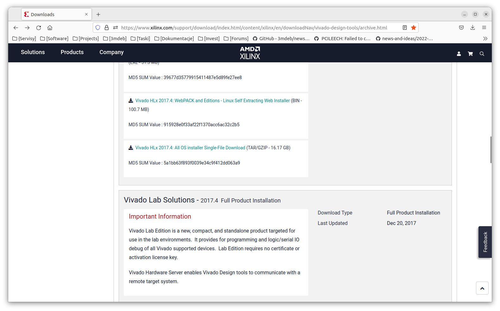
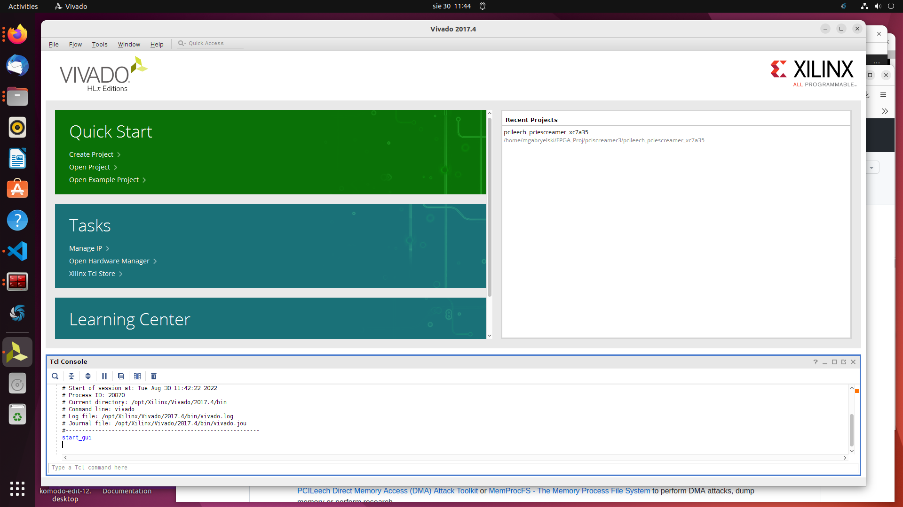
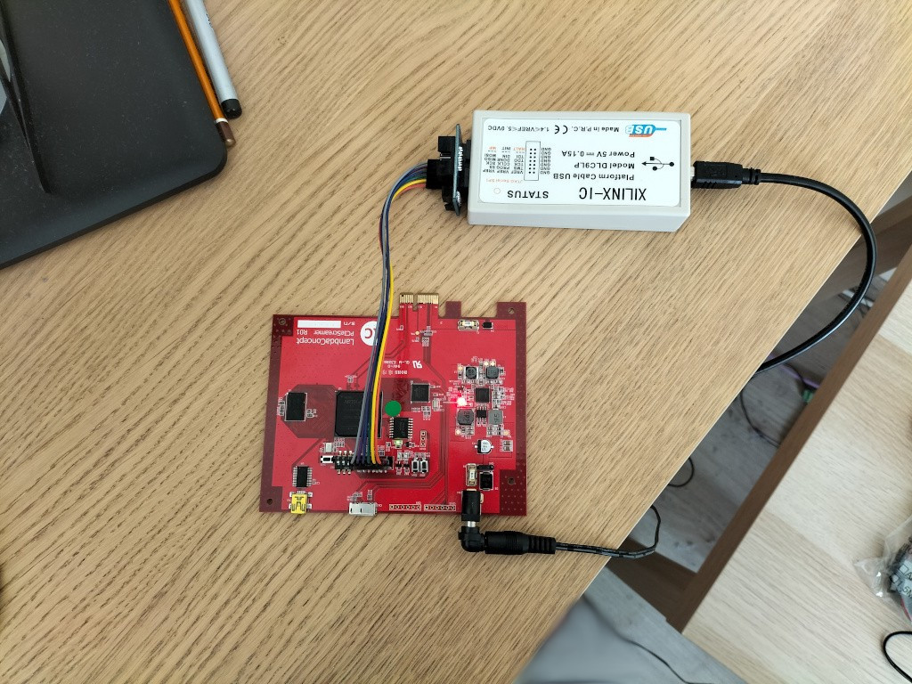

## Why test PCIe sniffing

Information security is a complicated topic. It needs to be considered in
every step of system design. Additionally, for every system, the threat model
may be different.
As a system includes multiple PCIe devices, that, i.e., can use the system's
memory and be shared to an untrusted virtual machine or can themself be
malicious there is a need to protect the memory from DMA attacks executed from
the PCIe bus.

To avoid this risk, there is an option to enable [IOMMU](https://blog.3mdeb.com/2021/2021-01-13-iommu/)
that should fix the problem, but does it?

To verify that IOMMU protects from DMA attacks, this functionality should
be tested, or in other words, it should be tried to make such an attack on a
system.

## What is PCIeScreamer

LambdaConcept's PCIeScreamer is an FPGA board based on Xilinx 7 Series XC7A35T.
The board has a PCIe connector, and it can be connected as the typical PCIe
device but remains under our complete control.

## FPGA development environment

The first step in using the FPGA was to prepare a development environment
for it. There are two significant toolchains. One of them is
[Intel® Quartus® Prime](https://www.intel.com/content/www/us/en/software/programmable/quartus-prime/overview.html)
designed for Intel's FPGA's, the other is
[Vivado Design Suite](https://www.xilinx.com/products/design-tools/vivado.html)
produced by Xilinx and designed for Xilinx FPGA's.

Because PCIeScreamer uses Xilinx FPGA, it needs the second one. There is one more
important factor related to the choice of the FPGA synthesis software version, 
the project is based on many IP Cores from Xilinx, many of them are dedicated to
a specific version of `Xilinx Vivado`. The `PCIScreamer` in revision `R01` wich we
have needs FPGA firmware in version `3.2` (2018). This version of firmware had 
been developed in `Xilinx Vivado 2017.4` and for building configuration file for
FPGA this archival version of `Vivado` is required.

## Xilinx Vivado installation 
One can download `Xilinx Vivado 2017.4` for Linux OS from Xilinx(AMD) Website
[Vivado Design Suite](https://www.xilinx.com/support/download/index.html/content/xilinx/en/downloadNav/vivado-design-tools/archive.html) In our opinion, the best choice is 
to download file called `Vivado HLx 2017.4: All OS installer Single-File Download`
 - See screenshot:

Installing vivado can take a while. At first, there is a need to create free
account at the Xilinx webpage and provide a few of personal details like your
name, company name, job function, and address. Here is step by step tutorial 
regarding the installation of `Xilinx Vivado` 
[Instalation of Vivado Design Suite](https://www.zachpfeffer.com/single-post/installing-20174-vivado-and-sdk-on-linux)

## Building FPGA configuration file (firmware)

Simply having an IDE installed is not enough to program an FPGA. It also needs
a correct design that can be programmed into the device. Although there are several
versions of the firmware for the board PCIScreamer, there is version 3.2 (Tag) from 
this github repository [PCIleech firmware for PCIScreamer](https://github.com/ufrisk/pcileech-fpga)
dedicated to R01 hardware revision.

To build `PCIleech firmware for PCIScreamer`, the following steps were tried:

1. Install Vivado.
2. Add Vivado to the `$PATH` environment variable.

   ```
   export PATH=$PATH:/opt/Xilinx/Vivado/2017.4/bin
   ```
   Your Vivado location may be different depending on options chosen during the
   installation process and installed version.

   You can check if you have done it correctly using the following command:

   ```
   vivado -version
   ```
3. Prepare a separate folder for project files and change your current working 
   directory to it.
4. Clone
   [PCIleech firmware for PCIScreamer](https://github.com/ufrisk/pcileech-fpga)
   and checkout the correct tag (v3.2)

   ```
   git clone https://github.com/ufrisk/pcileech-fpga.git
   cd pcileech-fpga
   git checkout tags/v3.2
   ```
5. After cloning the repository, the rest of the work will be carried out using the
 `Xilinx Vivado 2017.4` software. Luckily for us, the creators of the repository
 provided scripts in TCL that automate work with the project in Vivado. There are
 in subdirectory `pciescreamer` such TCL scripts:

 +  vivado_generate_project.tcl  - this script makes Vivado project
 +  vivado_build.tcl             - this script builds project
 +  vivado_flash_hs2.tcl         - this script writes bitstream in FPGA
  
 We are opening `Xilinx Viavdo` issuing in console command:
 ```bash
   vivado
 ```
 After Vivado main window is open we go to menu `Window` -> `TCL console`. In 
 bottom part of main window `TCL console` window appears - see screen-shot


In Vivado `TCL console` window we issue command:
```tcl
   source vivado_generate_project.tcl
```
After some time Vivado project will be created.

6. Aftere project has been created we issue second command in Vivado `TCL console`
   ```tcl
      source vivado_build.tcl
   ```
This command will recursively build the entire project, starting with the 
reconstruction of used IP Cores through the synthesis and implementation phase. 
As a result, an FPGA configuration file will be created. Attention! this command
may take up to an hour to execute (depending on the speed of the computer used).

7. The last command is:
   
  ```tcl
   vivado_flash_hs2.tcl 
  ```
  which is writing the configuration file (bitstream) to the FPGA board (using 
  JTAG programmer/debugger). Attention! Before issuing the last command JTAG 
  programmer (for example Xilinx Cable) must be properly connected to JTAG header 
  on PCIScreamer board and it must be properly powered - see screen-shot:

  
In our case after writing bitstream file to Flash memory of FPGA board there were
information in Vivado `TCL console` window that this operation was successful.

## Testing PCIScreamer board in desktop computer
After the correct programming of the PCIScreamer FPGA board, we proceeded to 
testing its operation in a real computer. After embedding the PCIScreamer board
in the PCI express slot and switching the power to PCI express, we started testing
it in the Linux operating system (Ubuntu). The green LED was on, which indicated 
that the power supply was correct and the board is working properly.Next step was
issuing command in console:
```bash
  $ lspci
``` 
This command list all devices seen on PCI bus in computer. Its result was:
```bash
mgabryelski@maciej-HP:~$ lspci
00:00.0 Host bridge: Intel Corporation Xeon E3-1200 v2/3rd Gen Core processor DRAM Controller (rev 09)
00:02.0 VGA compatible controller: Intel Corporation IvyBridge GT2 [HD Graphics 4000] (rev 09)
. . .
00:1f.5 IDE interface: Intel Corporation 7 Series/C210 Series Chipset Family 2-port SATA Controller [IDE mode] (rev 04)
02:00.0 Memory controller: Xilinx Corporation Device 7022 (rev 01)
mgabryelski@maciej-HP:~$
```
As you can see the last device was: **Memory controller: Xilinx Corporation Device
7022 (rev 01)** and this is how PCIScreamer should be visible on PCI bus.
After connecting the computer via USB 3.0 cable to the connector on the PCIScreamer
board, it should be visible in the OS. In order to check this, we ran the command 
in the console:
```bash
   $ lsusb
```
The result are below:
```bash
mgabryelski@maciej-HP:~$ lsusb
Bus 002 Device 002: ID 8087:0024 Intel Corp. Integrated Rate Matching Hub
Bus 002 Device 001: ID 1d6b:0002 Linux Foundation 2.0 root hub
Bus 001 Device 004: ID 093a:2510 Pixart Imaging, Inc. Optical Mouse
Bus 001 Device 003: ID 04d9:1602 Holtek Semiconductor, Inc. USB Keyboard
Bus 001 Device 005: ID 0403:601f Future Technology Devices International, Ltd Myriad-RF LimeSDR-Mini
Bus 001 Device 002: ID 8087:0024 Intel Corp. Integrated Rate Matching Hub
Bus 001 Device 001: ID 1d6b:0002 Linux Foundation 2.0 root hub
Bus 004 Device 001: ID 1d6b:0003 Linux Foundation 3.0 root hub
Bus 003 Device 001: ID 1d6b:0002 Linux Foundation 2.0 root hub
mgabryelski@maciej-HP:~$ 
```
The device: **Bus 001 Device 005: ID 0403:601f Future Technology Devices International, Ltd Myriad-RF LimeSDR-Mini** is FTDI (USB 3.0), and this is also 
valid.

Now we can go to tests with the application `PCIleech`. We can download ready-made
binary packages (Linux x64) from this page [PCIleech software](https://github.com/ufrisk/pcileech/releases/tag/v4.15) Po rozpakowaniu archiwum z aplikacją wydajemy w konsoli komendę:
```bash
mgabryelski@maciej-HP:~/PCIScreamer$ ./pcileech
./pcileech: error while loading shared libraries: libcrypto.so.1.1: cannot open shared object file: No such file or directory
mgabryelski@maciej-HP:~/PCIScreamer$
```
It turns out that `pcileech` depends on the archival version of the library
`openssl` (which is not available as package in OS repository). The solution was
building this library from sources. Here is sequence of command issued in console
in order to build this library:
```bash
wget https://www.openssl.org/source/openssl-1.1.1o.tar.gz
cd openssl-1.1.1o
./config
make
make test
sudo make install
find / -name libssl.so.1.1
ln -s /usr/local/lib64/libssl.so.1.1  /usr/lib64/libssl.so.1.1
ln -s /usr/local/lib64/libssl.so.1.1  /usr/lib/libssl.so.1.1
find / -name libcrypto.so.1.1
ln -s /home/ubuntu/openssl-1.1.1o/libcrypto.so.1.1    /usr/lib64/libcrypto.so.1.1
ln -s /home/ubuntu/openssl-1.1.1o/libcrypto.so.1.1     /usr/lib/libcrypto.so.1.1
```
After building the openssl library, a command was issued to test the communication
of the PCIScreamer board with the pcileech application:

```bash
mgabryelski@maciej-HP:~/PCIScreamer$ sudo ./pcileech probe -device fpga -v

DEVICE: FPGA: ERROR: Unable to load FTD3XX.dll [0,v0.0,0000]
PCILEECH: Failed to connect to the device.
mgabryelski@maciej-HP:~/PCIScreamer$ 
```
The FTDI for USB 3.0 chip is used to connect the PCIScreamer board with a PC, 
the driver is not embedded in the Linux kernel. So I compiled the driver
for the FTDI chip from the sources in this Github repository: [FTDI FT50x driver](https://github.com/ufrisk/pcileech/releases/tag/v4.15) The compilation was successful, 
and after it was finished we have such files in working directory:

```bash
mgabryelski@maciej-HP:~/GIT1/pcie_screamer/drivers/ft60x$ ls
51-ft60x.rules  ft60x.ko   ft60x.mod.c  ft60x.o     ftd3xx.h    Makefile       Module.symvers
ft60x.c         ft60x.mod  ft60x.mod.o  ftconfig.c  loopback.c  modules.order
mgabryelski@maciej-HP:
```
We try to load kernel module with FTDI driver issuing command:

```bash
mgabryelski@maciej-HP:~/PCIScreamer$ sudo insmod ft60x.ko
````

After that the kernel module is loaded:

```bash
mgabryelski@maciej-HP:~/PCIScreamer$ lsmod
Module                  Size  Used by
ft60x                  20480  0
algif_skcipher         16384  0
af_alg                 32768  1 algif_skcipher
binfmt_misc            24576  1
```
Now checking `pcileech` application we have;
```bash
gabryelski@maciej-HP:~/PCIScreamer$ sudo ./pcileech probe -device fpga -v

DEVICE: FPGA: ERROR: Unable to load FTD3XX.dll [0,v0.0,0000]
PCILEECH: Failed to connect to the device.
mgabryelski@maciej-HP:~/PCIScreamer$ 
```
As we can see, the problem still exists. I tried also building `pcileech` application 
from sources following this tutorial [PCILeech on Linux](https://github.com/ufrisk/pcileech/releases/tag/v4.15).
Unfortunately, all attempts to communicate the `pcileech` application with the 
PCIScreamer FPGA board ended in failure, therefore, more advanced  tests were 
not feasible.

## Problems with the stability of the PCIE Screamer board

PCIScreamer in revision R01 (which we have) is known for its stability problems
and with some motherboards it does not work at all.

The incorrect power delivered to the FPGA could be the result of the faulty PCIe
low-profile riser card used to connect the PCIeScreamer to the motherboard.

## Perspectives on further work

Further work should include checking the FPGA with a different motherboard,
preferably without a low-profile riser card. 

